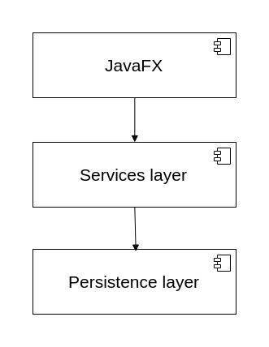
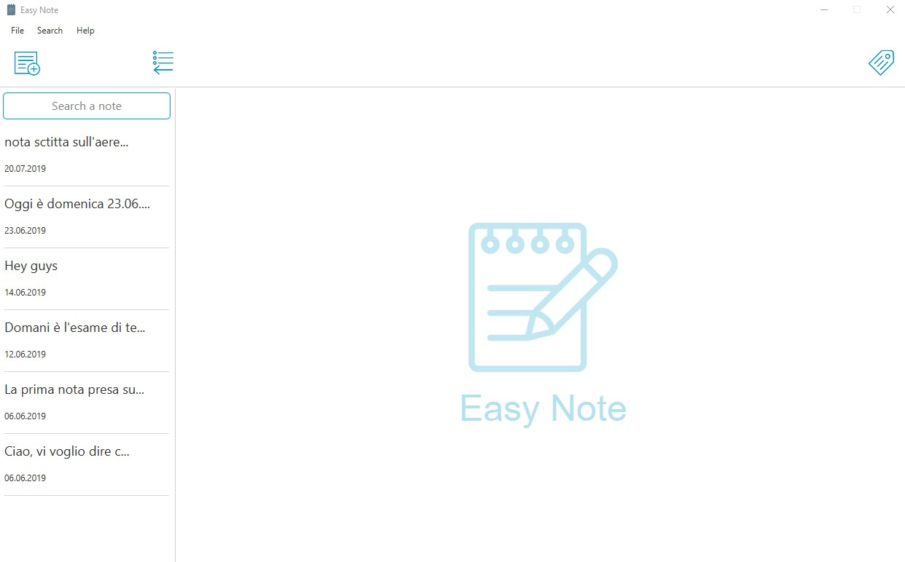

# About the project

Application's name: Easy Note

The application is developed as a semester project for the Software Engineering 1 course.

# Project description and requirements

The application allows you to take notes, organize them, and then be able to search for and edit them easily.

The GUI of the application was created with JavaFX. The data is persisted on the disk using files in CSV format.

## Overview

### Application's Architecture

### GUI

## Prerequisites

Java runtime environment version 11

## Installing

The application is available through an executable jar for operating systems:

Mac: EasyNote-mac.jar

Linux: EasyNote-linux.jar

Windows: EasyNote-win.jar

## Dependencies and Build Management

* **JFoenix**
* **Opencsv**

Dependencies and build are managed by Maven 

## Contributors and authors

* **Mohammad Halabi**

* **Nicolò Rubattu**

